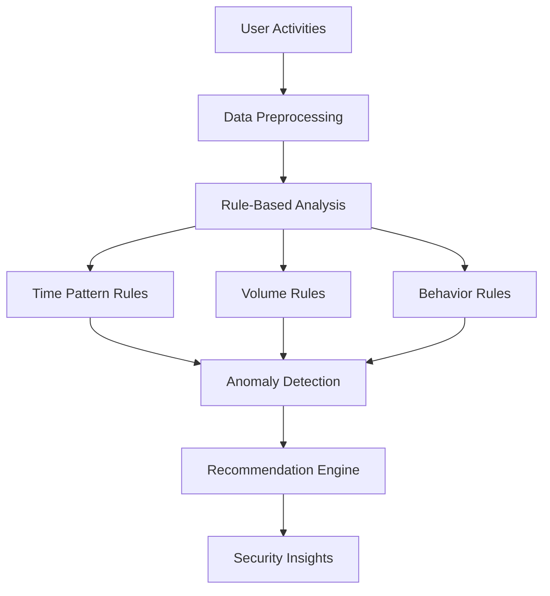
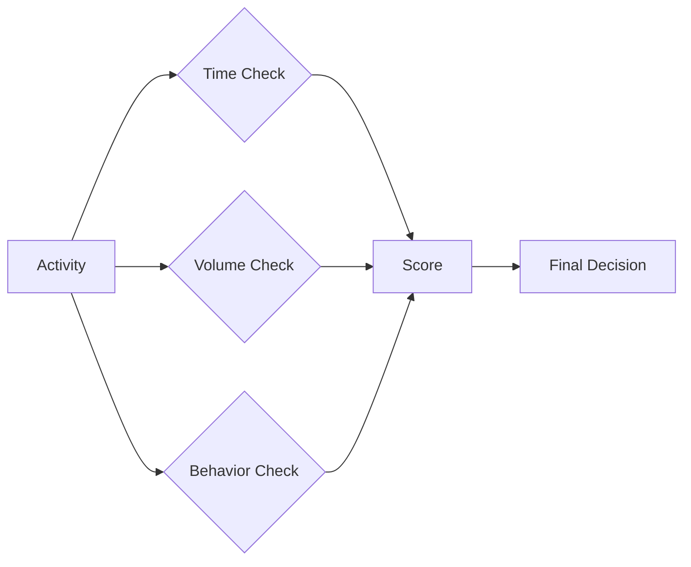
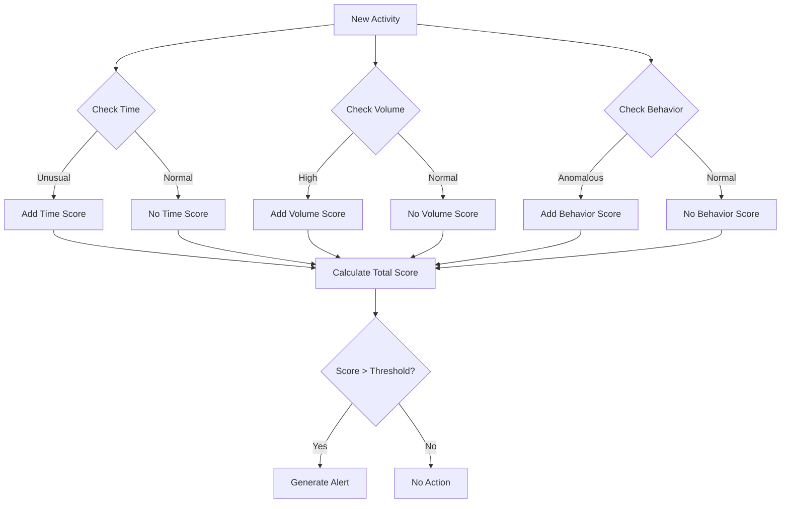
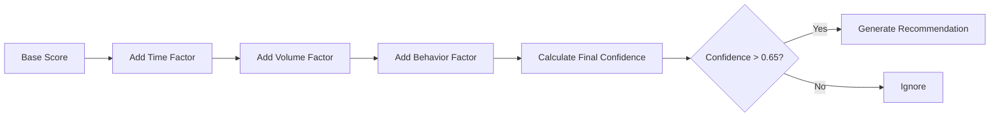
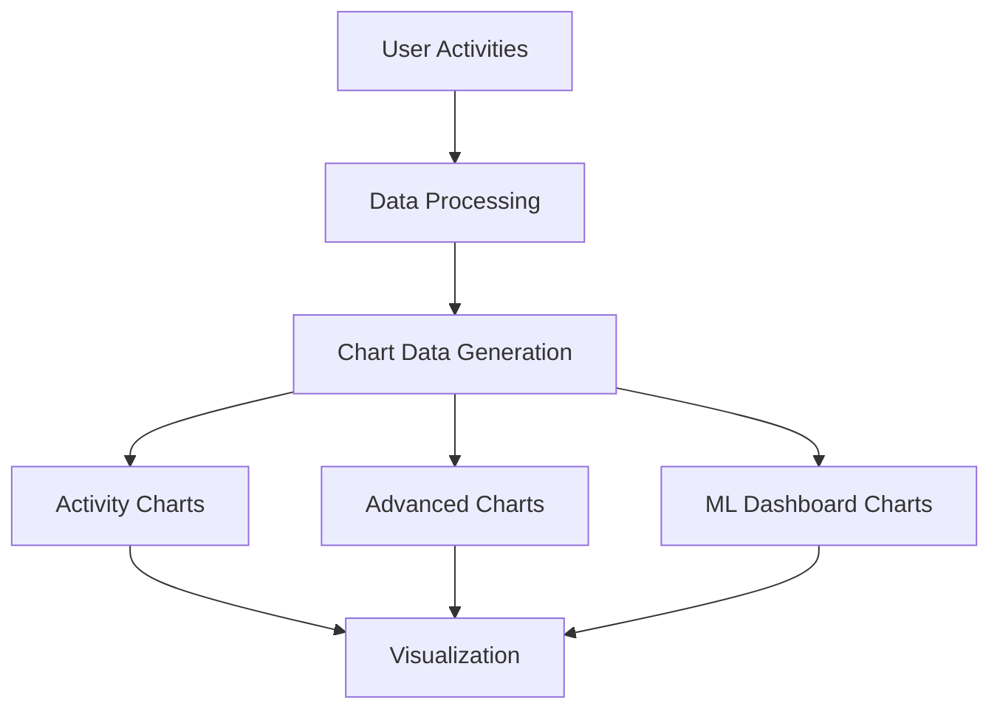

# Technical Documentation: Charts, Analytics, and ML Components

## Table of Contents
1. [Charts and Visualizations](#charts-and-visualizations)
2. [Advanced Analytics](#advanced-analytics)
3. [Machine Learning Components](#machine-learning-components)
4. [Data Processing Pipeline](#data-processing-pipeline)

## Charts and Visualizations

### Severity Trend Charts
The system implements adaptive severity trend charts that dynamically adjust to the data's time period:

#### Key Features
- **Adaptive Time Range**: Automatically detects and adapts to the actual time period of uploaded data
- **Smart Window Calculation**:
  - Minimum: 7 days (ensures readable visualization)
  - Maximum: 90 days (prevents performance issues)
  - Adaptive: Uses actual data span when reasonable
- **Severity Categories**:
  - Critical: ≥ 2001
  - High: 1500-2000
  - Medium: 1000-1499
  - Low: < 1000

#### Implementation Details
- Located in `app/dashboard/page.tsx` and `components/ActivityCharts.tsx`
- Uses centralized helper function `getDataTimeRange()` for consistent date handling
- Implements robust date parsing for multiple formats
- Optimized performance with efficient data structures

## Advanced Analytics

### Data Processing
The system employs sophisticated data processing techniques:

1. **Activity Status Classification**:
   - `underReview`: Activities pending assessment
   - `concern`: Identified concerning activities
   - `trusted`: Verified legitimate activities
   - `nonConcern`: Activities determined not to pose a risk

2. **Manager Action Integration**:
   - Tracks various action types (escalated, employeeCounselled, etc.)
   - Implements semantic normalization for consistent categorization
   - Uses multi-signal correlation for enhanced accuracy

3. **Performance Metrics**:
   - False positive/negative rate tracking
   - Recommendation precision and recall
   - Learning efficiency measurements
   - Operational impact assessment

## Machine Learning Components

### Rule-Based ML Implementation
The system implements a sophisticated rule-based machine learning approach that combines traditional rule-based detection with statistical analysis and pattern recognition:

#### Core Components

1. **Anomaly Detection System** (`ml/anomalyDetector.ts`):
   - **Rule-Based Thresholds**:
     - Low: 0.6
     - Medium: 0.75
     - High: 0.9
   - **Detection Features**:
     - Time pattern analysis
     - Data volume analysis
     - User behavior analysis
     - Activity sequence analysis
     - Temporal burst detection
     - Integration pattern analysis

2. **Recommendation Engine** (`ml/recommendationEngine.ts`):
   - **Pattern Detectors**:
     - Activity pattern detection
     - Unusual time pattern detection
     - Sensitive data access detection
     - Failed access attempt detection
     - Multi-location access detection
     - Unusual application usage detection
     - Account sharing detection
     - Sequential behavior detection
     - High volume activity detection
     - Frequency anomaly detection
     - Data volume anomaly detection
     - Integration anomaly detection

#### Rule-Based Analysis Process

1. **Baseline Establishment**:
   ```typescript
   // Example of baseline building
   buildBaselines(activities: UserActivity[]): void {
     // First pass: collect data points
     activities.forEach(activity => {
       this.updateGlobalBaseline(activity);
       this.updateUserBaseline(activity);
     });
     
     // Second pass: calculate statistics
     this.finalizeBaselines();
   }
   ```

2. **Pattern Detection Rules**:
   - **Time-Based Rules**:
     - Unusual hours (10 PM - 6 AM)
     - Critical hours (1 AM - 3 AM)
     - Temporal burst detection
   - **Volume-Based Rules**:
     - Data volume thresholds
     - Activity frequency thresholds
     - Burst detection multipliers
   - **Behavior-Based Rules**:
     - Sequential pattern detection
     - Location-based rules
     - Application usage patterns

3. **Confidence Scoring**:
   ```typescript
   // Example of confidence calculation
   calculateConfidence(score: number, threshold: number, factors: string[]): number {
     const baseConfidence = score / threshold;
     const factorBonus = factors.length * 0.1;
     return Math.min(baseConfidence + factorBonus, 1.0);
   }
   ```

#### Integration with Traditional ML

1. **Statistical Analysis**:
   - Z-score calculations for volume anomalies
   - Standard deviation-based thresholds
   - Moving averages for trend detection

2. **Pattern Recognition**:
   - User behavior profiling
   - Activity sequence analysis
   - Integration pattern detection

3. **Adaptive Thresholds**:
   ```typescript
   // Example of adaptive threshold calculation
   getAdaptiveThreshold(activity: UserActivity): number {
     const baseThreshold = this.config.lowThreshold;
     const userBaseline = this.userBaselines.get(activity.userId);
     
     if (userBaseline) {
       const riskHistory = userBaseline.riskScoreHistory;
       const avgRisk = riskHistory.reduce((a, b) => a + b, 0) / riskHistory.length;
       return baseThreshold * (1 + avgRisk);
     }
     
     return baseThreshold;
   }
   ```

### ML Enhancement Features

1. **Supervised Learning Integration**:
   - Uses `concern` activities as positive training examples
   - Uses `trusted` and `nonConcern` as negative examples
   - Implements robust classification system

2. **Confidence Score System**:
   - Dynamic confidence adjustment based on pattern matching
   - Historical accuracy consideration
   - Status distribution-based scaling

3. **Feedback Loop System**:
   - Continuous model updates based on new classifications
   - Active learning for ambiguous cases
   - Performance tracking over time

### Technical Implementation

1. **Data Preprocessing**:
   - Status and manager action filtering
   - Label normalization
   - Weighted training dataset creation
   - Activity sanitization and validation

2. **ML Pipeline**:
   - Extended `RecommendationEngine` integration
   - Confidence adjustment mechanisms
   - Performance tracking systems
   - Real-time anomaly detection

3. **Algorithm Features**:
   - Ensemble methods for multiple signal combination
   - Bias detection and correction
   - Active learning prioritization
   - Rule-based pattern matching

## Data Processing Pipeline

### 1. Data Collection
- User activity data from IndexedDB
- Manager actions and status updates
- Historical classification data

### 2. Preprocessing
- Date normalization
- Status classification
- Action categorization

### 3. Analysis
- Pattern recognition
- Anomaly detection
- Recommendation generation

### 4. Visualization
- Adaptive chart generation
- Severity trend analysis
- Performance metrics display

## Performance Considerations

1. **Optimization Techniques**:
   - Efficient date mapping using Map data structure
   - Single-pass activity processing
   - Optimized sorting algorithms
   - Caching mechanisms

2. **Resource Management**:
   - Tiered processing for large datasets
   - Selective computation for complex operations
   - Memory-efficient data structures

## Security and Privacy

1. **Data Protection**:
   - Strong anonymization techniques
   - Purpose limitation implementation
   - Secure data handling protocols

2. **Bias Management**:
   - Systematic bias detection
   - Fairness algorithm implementation
   - Equal treatment across departments/roles

## Future Enhancements

1. **Planned Improvements**:
   - Enhanced pattern recognition
   - Advanced anomaly detection
   - Improved recommendation accuracy
   - Extended visualization capabilities

2. **Research Areas**:
   - Deep learning integration
   - Real-time processing optimization
   - Advanced visualization techniques
   - Enhanced user feedback systems

## Rule-Based ML System: Visual Guide

### System Overview


### 1. How It Works: Step by Step

#### Step 1: Data Collection
- Collects user activities from IndexedDB
- Tracks:
  - Timestamps
  - User IDs
  - Activity types
  - Data volumes
  - Locations
  - Applications used

#### Step 2: Rule Application


#### Step 3: Pattern Detection
- **Time Patterns**:
  ```
  Normal Hours: 6 AM - 10 PM
  Unusual Hours: 10 PM - 6 AM
  Critical Hours: 1 AM - 3 AM
  ```

- **Volume Patterns**:
  ```
  Low: < 1000 units
  Medium: 1000-1499 units
  High: 1500-2000 units
  Critical: > 2000 units
  ```

### 2. Real-World Examples

#### Example 1: Unusual Time Access
```typescript
// Activity at 2 AM
{
  timestamp: "2024-03-15T02:00:00",
  userId: "user123",
  activity: "data_access"
}

// Rule Triggered:
if (hour >= 22 || hour <= 6) {
  score += 0.3;  // Unusual time bonus
  if (hour >= 1 && hour <= 3) {
    score += 0.2;  // Critical hours bonus
  }
}
```

#### Example 2: High Volume Activity
```typescript
// User accessing 2500 units of data
{
  volume: 2500,
  userId: "user123",
  activity: "data_download"
}

// Rule Triggered:
if (volume > 2000) {
  severity = "critical";
  confidence = 0.9;
  factors.push("Excessive data volume");
}
```

### 3. Decision Making Process



### 4. Confidence Scoring System



### 5. Key Benefits

1. **Transparency**
   - Clear rules and thresholds
   - Easy to understand decisions
   - Explainable results

2. **Adaptability**
   - Adjustable thresholds
   - Learning from manager actions
   - User-specific baselines

3. **Performance**
   - Fast processing
   - Real-time detection
   - Efficient resource usage

### 6. Common Use Cases

1. **After-Hours Access**
   ```
   Time: 2 AM
   Action: Data Access
   Result: High Severity Alert
   ```

2. **Data Volume Spike**
   ```
   Normal: 500 units/day
   Current: 2500 units
   Result: Critical Alert
   ```

3. **Unusual Behavior**
   ```
   Pattern: Multiple failed logins
   Location: New IP address
   Result: Medium Severity Alert
   ```

## Chart Production and Visualization

### Chart Components Overview



### 1. Chart Types and Implementation

#### Activity Charts (`components/ActivityCharts.tsx`)
- **Risk Trend Chart**
  ```typescript
  <LineChart data={timeData}>
    <Line type="monotone" dataKey="count" name="Activities" />
    <Line type="monotone" dataKey="risk" name="Risk Score" />
  </LineChart>
  ```
  - Shows activity count and risk score over time
  - Uses dual Y-axis for different metrics
  - Implements gradient fills for visual appeal

- **Severity Trend Chart**
  ```typescript
  <LineChart data={severityTrend}>
    <Line dataKey="critical" name="Critical" stroke="#f44336" />
    <Line dataKey="high" name="High" stroke="#ff9800" />
    <Line dataKey="medium" name="Medium" stroke="#2196f3" />
    <Line dataKey="low" name="Low" stroke="#4caf50" />
  </LineChart>
  ```
  - Displays severity distribution over time
  - Color-coded by severity level
  - Interactive tooltips with detailed information

#### Advanced Charts (`components/AdvancedCharts.tsx`)
- **Risk Score Trend**
  - Average risk score calculation
  - Time-based aggregation
  - Custom tooltips with detailed metrics

- **User Activity Distribution**
  - Vertical bar charts for user comparison
  - Activity count and high-risk activity separation
  - Interactive filtering and sorting

### 2. Data Processing for Charts

#### Time Series Data Processing
```typescript
function calculateActivityOverTime(activities: UserActivity[]): ChartDataPoint[] {
  // Initialize date map
  const dateMap = new Map<string, { count: number, totalRisk: number }>();
  
  // Process activities
  activities.forEach(activity => {
    const dateStr = getActivityDate(activity);
    if (!dateMap.has(dateStr)) {
      dateMap.set(dateStr, { count: 0, totalRisk: 0 });
    }
    
    const entry = dateMap.get(dateStr)!;
    entry.count++;
    entry.totalRisk += activity.riskScore || 0;
  });
  
  // Convert to chart data
  return Array.from(dateMap.entries())
    .map(([date, data]) => ({
      date,
      count: data.count,
      risk: Math.round(data.totalRisk / data.count)
    }))
    .sort((a, b) => new Date(a.date).getTime() - new Date(b.date).getTime());
}
```

#### Severity Distribution Processing
```typescript
function calculateSeverityTrend(activities: UserActivity[]): SeverityDataPoint[] {
  const severityData = activities.reduce((acc, activity) => {
    const date = activity.date || new Date().toISOString().split('T')[0];
    if (!acc[date]) {
      acc[date] = {
        date,
        critical: 0,
        high: 0,
        medium: 0,
        low: 0
      };
    }
    
    const score = activity.riskScore || 0;
    if (score >= 2001) acc[date].critical++;
    else if (score >= 1500) acc[date].high++;
    else if (score >= 1000) acc[date].medium++;
    else acc[date].low++;
    
    return acc;
  }, {} as Record<string, SeverityDataPoint>);
  
  return Object.values(severityData);
}
```

### 3. Interactive Features

#### Time Range Selection
```typescript
const [timeRange, setTimeRange] = useState('30');
const handleTimeRangeChange = (event: SelectChangeEvent) => {
  setTimeRange(event.target.value);
  // Recalculate chart data
  setChartData(calculateActivityOverTime(activities, parseInt(event.target.value)));
};
```

#### Severity Filtering
```typescript
const [severityFilters, setSeverityFilters] = useState({
  critical: true,
  high: true,
  medium: true,
  low: true
});

const getFilteredData = () => {
  return severityTrendData.map(item => ({
    date: item.date,
    critical: severityFilters.critical ? item.critical : 0,
    high: severityFilters.high ? item.high : 0,
    medium: severityFilters.medium ? item.medium : 0,
    low: severityFilters.low ? item.low : 0,
  }));
};
```

### 4. Visual Styling

#### Color Schemes
```typescript
const COLORS = {
  risk: {
    low: '#4caf50',
    medium: '#2196f3',
    high: '#ff9800',
    critical: '#f44336',
  },
  status: {
    underReview: '#2196f3',
    trusted: '#4caf50',
    concern: '#ff9800',
    nonConcern: '#9e9e9e'
  }
};
```

#### Chart Styling
```typescript
<ResponsiveContainer width="100%" height={300}>
  <LineChart
    data={data}
    margin={{ top: 20, right: 30, left: 20, bottom: 5 }}
  >
    <CartesianGrid strokeDasharray="3 3" stroke="#2d2e44" />
    <XAxis 
      dataKey="date" 
      tick={{ fill: '#bdbdfc', fontFamily: 'Inter', fontSize: 13 }}
    />
    <YAxis 
      tick={{ fill: '#bdbdfc', fontFamily: 'Inter', fontSize: 13 }}
    />
    <Tooltip 
      contentStyle={{ 
        backgroundColor: '#1F2030',
        border: '1px solid #333'
      }}
    />
  </LineChart>
</ResponsiveContainer>
```

### 5. Performance Optimizations

1. **Data Processing**
   - Efficient date mapping using Map data structure
   - Single-pass activity processing
   - Optimized sorting algorithms

2. **Rendering**
   - Responsive container for dynamic sizing
   - Memoized calculations for chart data
   - Efficient re-rendering with React hooks

3. **Memory Management**
   - Cleanup of unused chart instances
   - Proper disposal of event listeners
   - Efficient data structure usage

## Performance Considerations

1. **Optimization Techniques**:
   - Efficient date mapping using Map data structure
   - Single-pass activity processing
   - Optimized sorting algorithms
   - Caching mechanisms

2. **Resource Management**:
   - Tiered processing for large datasets
   - Selective computation for complex operations
   - Memory-efficient data structures

## Security and Privacy

1. **Data Protection**:
   - Strong anonymization techniques
   - Purpose limitation implementation
   - Secure data handling protocols

2. **Bias Management**:
   - Systematic bias detection
   - Fairness algorithm implementation
   - Equal treatment across departments/roles

## Future Enhancements

1. **Planned Improvements**:
   - Enhanced pattern recognition
   - Advanced anomaly detection
   - Improved recommendation accuracy
   - Extended visualization capabilities

2. **Research Areas**:
   - Deep learning integration
   - Real-time processing optimization
   - Advanced visualization techniques
   - Enhanced user feedback systems

## Rule-Based ML System: Visual Guide

### System Overview


### 1. How It Works: Step by Step

#### Step 1: Data Collection
- Collects user activities from IndexedDB
- Tracks:
  - Timestamps
  - User IDs
  - Activity types
  - Data volumes
  - Locations
  - Applications used

#### Step 2: Rule Application


#### Step 3: Pattern Detection
- **Time Patterns**:
  ```
  Normal Hours: 6 AM - 10 PM
  Unusual Hours: 10 PM - 6 AM
  Critical Hours: 1 AM - 3 AM
  ```

- **Volume Patterns**:
  ```
  Low: < 1000 units
  Medium: 1000-1499 units
  High: 1500-2000 units
  Critical: > 2000 units
  ```

### 2. Real-World Examples

#### Example 1: Unusual Time Access
```typescript
// Activity at 2 AM
{
  timestamp: "2024-03-15T02:00:00",
  userId: "user123",
  activity: "data_access"
}

// Rule Triggered:
if (hour >= 22 || hour <= 6) {
  score += 0.3;  // Unusual time bonus
  if (hour >= 1 && hour <= 3) {
    score += 0.2;  // Critical hours bonus
  }
}
```

#### Example 2: High Volume Activity
```typescript
// User accessing 2500 units of data
{
  volume: 2500,
  userId: "user123",
  activity: "data_download"
}

// Rule Triggered:
if (volume > 2000) {
  severity = "critical";
  confidence = 0.9;
  factors.push("Excessive data volume");
}
```

### 3. Decision Making Process


### 4. Confidence Scoring System


### 5. Key Benefits

1. **Transparency**
   - Clear rules and thresholds
   - Easy to understand decisions
   - Explainable results

2. **Adaptability**
   - Adjustable thresholds
   - Learning from manager actions
   - User-specific baselines

3. **Performance**
   - Fast processing
   - Real-time detection
   - Efficient resource usage

### 6. Common Use Cases

1. **After-Hours Access**
   ```
   Time: 2 AM
   Action: Data Access
   Result: High Severity Alert
   ```

2. **Data Volume Spike**
   ```
   Normal: 500 units/day
   Current: 2500 units
   Result: Critical Alert
   ```

3. **Unusual Behavior**
   ```
   Pattern: Multiple failed logins
   Location: New IP address
   Result: Medium Severity Alert
   ``` 